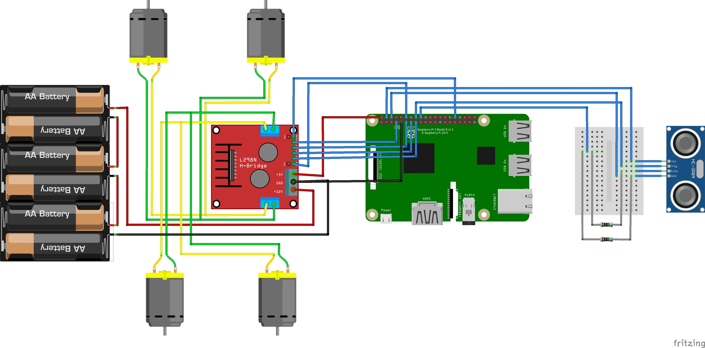

# AutoCar
Project to make an autonomous car with a Raspberry pi 3 that can stay in its lane and can recognize signals.

The Raspberry pi has a L298N motor controller, 4 motors, a HC-SR04 ultrasonic sensor and a camera. It's all programmed with [Python](https://www.python.org/) and [OpenCV](https://opencv.org/)

# Scheme

